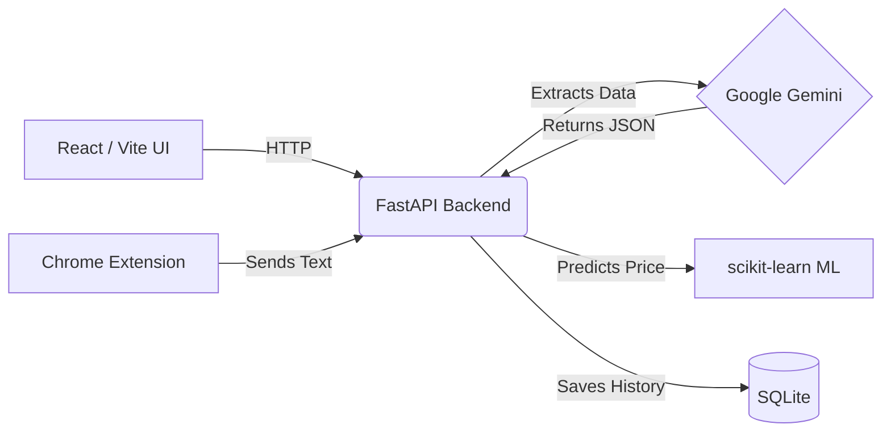

<div align="center">
  <h1>🚗 OtoScope</h1>
  <p><strong>AI-powered analysis and valuation tool for Turkish used-car listings (sahibinden.com & arabam.com)</strong></p>
  
  <p>
    
    
    
    
    
  </p>
</div>

<br />

OtoScope takes the raw text of a used-car listing, sends it to **Google Gemini** through a fast backend, and returns a structured, professional analysis. It acts as your personal "Oto Sanayi Ustası", giving you an estimated market value, an opportunity score, pros/cons, and even chronic issues for that specific vehicle.

## ✨ Features

- 🧠 **AI-Powered Analysis:** Leverages Google Gemini (with smart fallback routing) to understand messy listing text.
- 💰 **Market Valuation:** Computes a realistic market price range and compares it to the asking price.
- ⚠️ **Chronic Issues Detection:** Automatically flags known engine/transmission chronic issues for the specific car model.
- 🗣️ **User Consensus:** Summarizes general user experiences and satisfaction for the vehicle.
- 🤖 **Local ML Price Model:** Includes a custom `scikit-learn` Random Forest model trained daily on historical data for an independent price check.
- 🔌 **Browser Extension:** Includes a Chrome Extension to analyze listings on sahibinden.com and arabam.com with a single click.

## 🏗 Architecture



| Layer         | Responsibility                                               |
|---------------|--------------------------------------------------------------|
| `client/`     | React + Vite UI — presentation only, no secrets              |
| `extension/`  | Chrome/Edge Extension to grab listing text instantly         |
| `server/`     | FastAPI backend, ML models, Gemini integration, and SQLite DB|

## 🚀 Getting Started

### 1. Backend (FastAPI)

```bash
# Clone the repository
git clone https://github.com/YOUR_USERNAME/OtoScope.git
cd OtoScope

# Create and activate a virtual environment
python -m venv .venv
.\.venv\Scripts\Activate.ps1        # Windows
# source .venv/bin/activate          # macOS / Linux

# Install dependencies
pip install -r server/requirements.txt

# Configure your API key
cp server/.env.example server/.env   # Edit server/.env and set GEMINI_API_KEY
```

> **Note:** The backend uses a fallback system (`gemini-3.1-flash-lite`, `gemini-3.5-flash`, etc.) to bypass rate limits automatically.

```bash
# (Optional) Train the local ML price model
python server/ml.py train

# Run the API
uvicorn main:app --app-dir server --reload
```
*API runs at `http://localhost:8000`. Interactive docs at `http://localhost:8000/docs`.*

### 2. Frontend (React)

```bash
cd client
npm install
npm run dev
```
*Frontend runs at `http://localhost:5173`.*

### 3. Chrome Extension

1. Open Google Chrome and navigate to `chrome://extensions/`.
2. Enable **"Developer mode"** in the top right corner.
3. Click **"Load unpacked"** and select the `OtoScope/extension/` folder.
4. Go to any car listing on **sahibinden.com** or **arabam.com** and click the floating "OtoScope ile Analiz Et" button!

## 🤝 Contributing

We welcome contributions! Please see our [Contributing Guide](CONTRIBUTING.md) for details on how to submit pull requests, report issues, and request features. Make sure to adhere to our [Code of Conduct](CODE_OF_CONDUCT.md).

## 📄 License

This project is licensed under the **MIT License** - see the [LICENSE](LICENSE) file for details.
